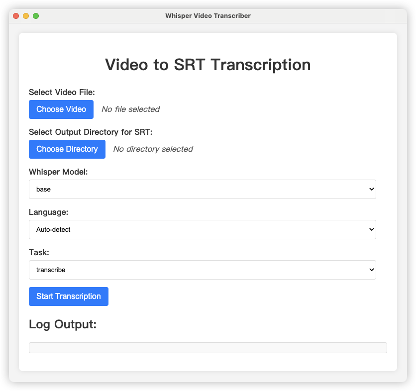

          
# Electron Whisper GUI

一个基于 Electron 和 OpenAI Whisper 的视频字幕生成工具，支持多语言转录和翻译功能。



## 功能特点

- 支持多种视频格式（MP4, MKV, MOV, AVI, WEBM, FLV, WMV）
- 支持多种 Whisper 模型（从 tiny 到 large-v3）
- 支持自动语言检测
- 支持多语言转录
- 支持翻译功能
- 支持 GPU 加速（CUDA 和 Apple Silicon）
- 简洁的图形用户界面

## 安装要求

- Node.js (>= 14.0.0)
- Python 3.8+
- FFmpeg
- PyTorch
- OpenAI Whisper

## 安装步骤

1. 克隆仓库：
```bash
git clone <repository-url>
cd electron-whisper-app
```

2. 安装 Node.js 依赖：
```bash
npm install
```

3. 安装 Python 依赖：
```bash
pip3 install torch openai-whisper
```

4. 安装 FFmpeg（macOS）：
```bash
brew install ffmpeg
```

## 使用方法

1. 启动应用：
```bash
npm start
```

2. 在应用界面中：
   - 点击「选择视频文件」按钮选择要处理的视频
   - 点击「选择输出目录」按钮选择 SRT 文件的保存位置
   - 选择合适的 Whisper 模型（建议从小模型开始尝试）
   - 选择目标语言（可选，默认自动检测）
   - 选择任务类型（转录或翻译）
   - 点击「开始转录」按钮

3. 等待处理完成，SRT 文件将保存在指定目录

## 开发

- 使用开发模式启动（支持热重载）：
```bash
npm run watch
```

- 打包应用：
```bash
npm run dist
```

## 注意事项

- 较大的模型（medium、large 等）需要更多的内存和处理时间
- 建议先用小模型测试，确认效果后再使用大模型
- 确保系统已正确安装 FFmpeg，否则无法提取音频

## 许可证

Apache 2.0

## 贡献

欢迎提交 Issue 和 Pull Request！

---

注意：您需要创建 `docs` 目录并添加一张应用界面的截图，命名为 `app-screenshot.png`。
        
